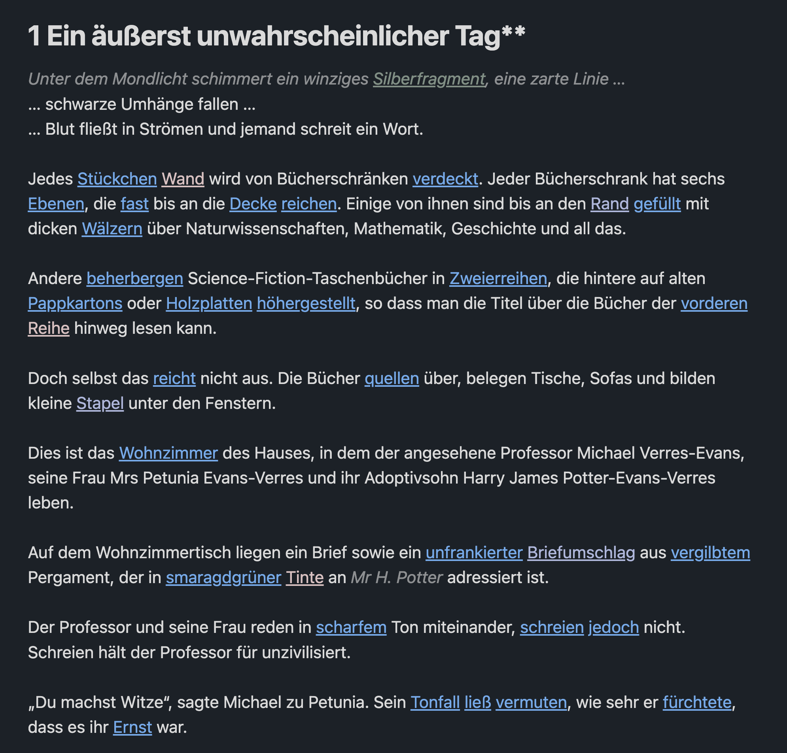
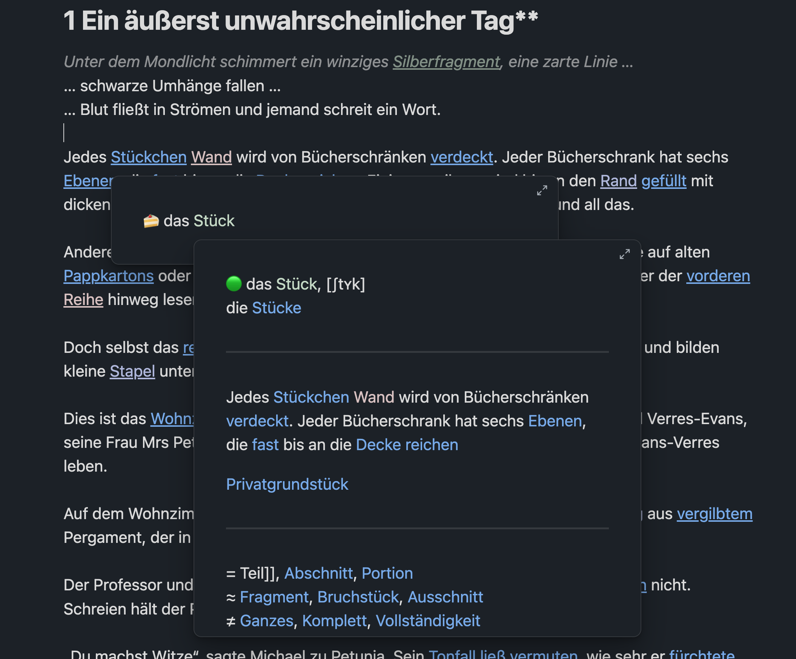
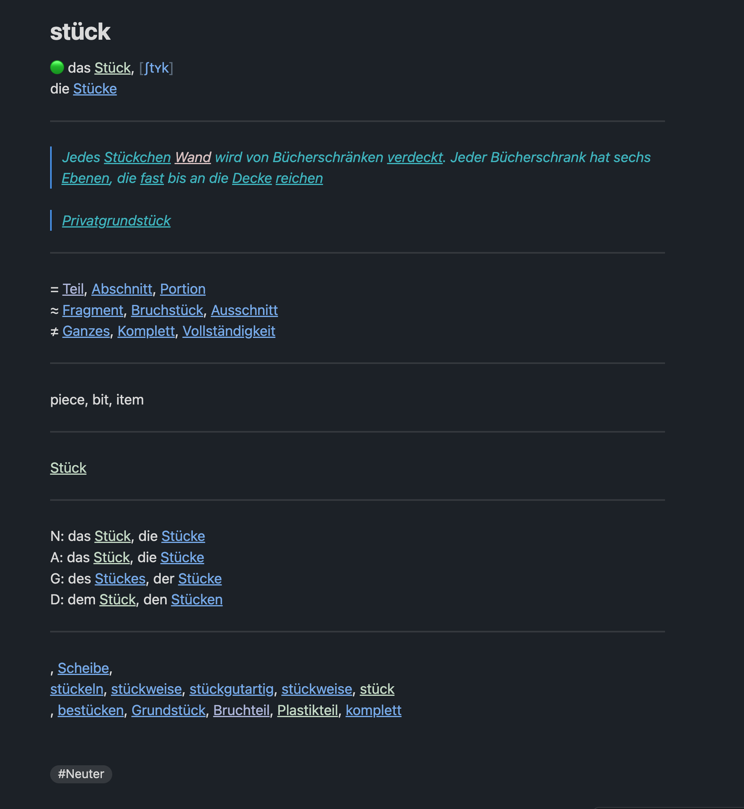
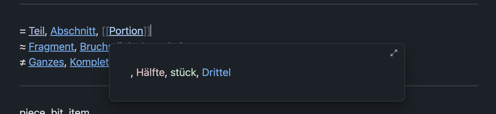
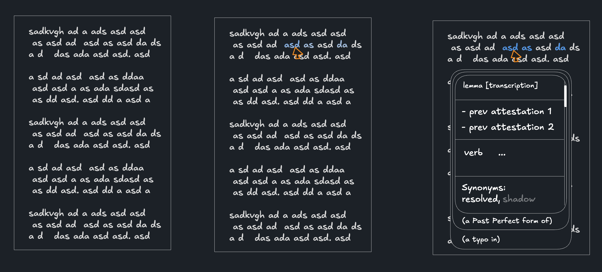

# tf-demo vision (WIP)

Core wayfinder: [#159: tf-demo linked Notes and source-context navigation](https://github.com/clockblocker/texteater/issues/159)

tf-demo is the proper implementation of an idea first explored in Obsidian:

> A learner builds a map of a language from the language they actually
> encounter.

The product starts with reading, not with a prebuilt dictionary. The learner
moves through Texts, resolves unfamiliar language in context, and creates or
reuses linked Reading Notes. The dictionary and language map emerge from those
encounters.

```text
Read -> encounter -> resolve -> create or reuse a Reading Note
     -> explore -> return to reading
```

## Core experience

Texts remain continuous reading material rather than becoming worksheets.
Resolvable language is interactive in place, as in the original prototype:



The Obsidian prototype opened a Reading Note preview without losing the reading
position:



The complete Reading Note combines the selected Reading's Knowledge with its
source encounters and links to related notes:



It also allowed links inside a note to open nested previews:



The sketches also explored stacked Notes that reveal more content as resolution
progresses:



The first tf-demo implementation keeps the linked-note model while using a
simpler navigation rule: every link switches the current view to its target.
This applies uniformly to Texts, Unit Reading Notes, Route Notes, Shadow Notes,
and source encounters. Preview-on-hover, nested preview stacks, split views, and
other alternatives are deferred until the direct-navigation demo is working.

### Progressive Note resolution

Selecting a Segment switches immediately to a note-shaped resolution view. The
learner does not wait on a blank Text while the entire model pipeline finishes.
Known or cached content appears immediately, unresolved sections show a loading
state, and each section becomes usable as its result arrives:

```text
Segment selected
    -> target Note view opens
    -> available Route content appears
    -> Unit Reading identity appears
    -> Knowledge appears
    -> resolved and Shadow links appear
```

The same view represents the Note throughout this progression; loading,
partial, and complete results are states of one Note rather than separate
screens. The exact content hierarchy and Family-specific presentation are
deferred.

### Segment states

Interactive Segments use `#4d8ce6` as their single initial accent color.
Differences in opacity distinguish available, selected, resolving, and resolved
states, including every member Segment of one occurrence. Returning from a Note
to a Source Context highlights every member Segment with a one-shot emphasis
animation so the learner can reacquire the occurrence. Exact opacity values,
animation timing and easing, secondary colors, and other visual polish are
deferred.

## View inventory and navigation contract

The first demo has five learner-facing view families. These route shapes are the
initial interface; app-owned database IDs keep large linguistic fingerprints out
of URLs.

| View | Initial route shape | Primary entry | Main outgoing links |
| --- | --- | --- | --- |
| Library | `/library` | App entry | Texts |
| Text | `/text/:textId` | Library or Source Context | Unit Reading Notes; optional Route Notes |
| Unit Reading Note | `/note/reading/:readingId` | Resolved Segment or another Note | Source Contexts, related Unit Reading Notes, Route Notes, Shadow Notes |
| Route Note | `/note/route/:kind/:id` | Shortcut/settings-enabled drill-down | Adjacent Route Notes and reached Unit Reading Notes |
| Shadow Note | `/note/shadow/:shadowId` | Unresolved relation or structure link | Referring Unit Reading Notes and any resolved targets |

Every link replaces the current view with its target. Browser history remains the
way back. Resolution before a `readingId` exists is a transient state of the same
note-shaped view, not a sixth note kind; its canonical Unit Reading Note route
becomes available when the Reading is committed. The exact transient URL is
deferred until the resolution orchestration is designed.

### Return to a Source Context

A Unit Reading Note accumulates Source Contexts as new Occurrence Attestations
resolve to that Reading. Each context shows the occurrence in its surrounding
Sentence and is clickable. Its initial deep-link shape is:

```text
/text/:textId?at=:attestationId
```

The app-owned `attestationId` identifies the exact source occurrence. At the
destination, the Text view verifies that its Sentence belongs to the requested
Text, then derives the Sentence anchor and every member Segment index from the
Occurrence Attestation. Sentence and Segment coordinates remain rendering data;
they do not duplicate occurrence identity in the URL.

Opening this link must:

1. switch the current view to the originating Text;
2. scroll after layout so the target Source Context is centered in the viewport;
3. apply the focus highlight to every member Segment, including discontinuous
   members; and
4. run a one-shot emphasis animation over the highlighted members.

The locator stays in the URL so reload, browser history, and copied links preserve
the focused position. If analysis stripping has made the Occurrence Attestation
unavailable, the Text still opens and reports that the Source Context is no
longer available rather than resolving a Segment again implicitly. This also
prevents a stale link from silently targeting a new occurrence later created at
the same sentence and Segment coordinates.

## Note kinds

### Unit Reading Note

```text
Note<UnitReading>
└── UnitReading
    ├── Lexeme
    ├── Phraseme
    └── Morpheme
```

The Unit Reading Note is the primary note kind and concentrates almost all of
the learner-facing value. Its subject is a Reading whose Lemma Family is
Lexeme, Phraseme, or Morpheme: the point at which grammatical identity and one
semantic identity meet.

All three Families use the same kind of note. Their grammatical shape changes
which Knowledge and structure the note emphasizes, but does not create three
parallel note systems.

The note also accumulates one Source Context for every surviving Occurrence
Attestation that points to the Reading. These are navigable evidence of where the
learner encountered the Reading, not part of Reading identity. Following one
returns to the exact Text location under the return-to-source contract above.

A Unit Shadow whose Family is Lexeme, Phraseme, or Morpheme can eventually
resolve to a Unit Reading and become a navigable Unit Reading Note. In current
Morphological Trees, lexical leaves are Unit Shadows while Morpheme leaves are
already represented by Morpheme Readings. Construction is deliberately not
included in Unit Reading; its note projection remains to be decided.

### Route Note

```text
RouteNote
├── Note<OccurrenceAttestation>
├── Note<Surface>
└── Note<Lemma>
```

Route Notes expose how one contextual encounter reached a Unit Reading:

```text
Text / Segment
    -> Occurrence Attestation
    -> Surface
    -> Lemma
    -> Unit Reading
```

They are optional drill-down views rather than part of the default reading
flow. A learner may enable them in settings or request them with a shortcut
while selecting a Segment or following a note link.

The Lemma Route Note connects every Unit Reading that shares one grammatical
identity. A learner can use it to move among polysemous or grammatically
indistinguishable homonymous Readings. Surface and Lemma Route Notes may also
expose same-form links derived from distinct grammatical identities. Those
links are for navigation; they are not Semantic Relations.

### Shadow Note

A Shadow Note makes the unresolved frontier navigable before one exact Reading
has been identified. It presents the Unit Shadow's Canonical Form, Family, and
Kind together with every pending semantic relation and structural reference
that points to it.

The Unit Shadow owns none of those references. tf-demo may give the stored
Shadow Note projection an application-owned `shadowId`, and opening it must be
able to retrieve all related references through bounded indexed lookups. That
ID supports navigation and retrieval only; it does not give the underlying Unit
Shadow linguistic identity or turn it into a provisional Reading.

Equal-looking references collected by one Shadow Note may eventually resolve
to different Unit Readings. Resolution therefore replaces each pending
reference independently rather than converting the Shadow Note wholesale into
one Unit Reading Note.
